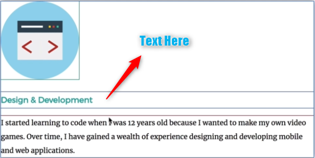
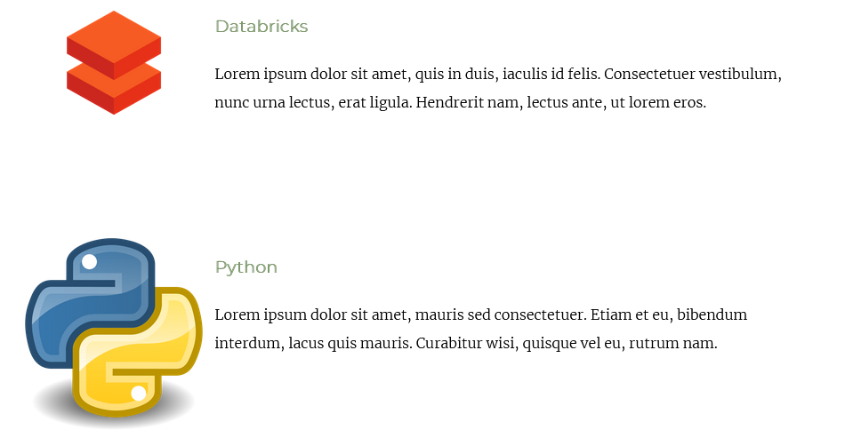
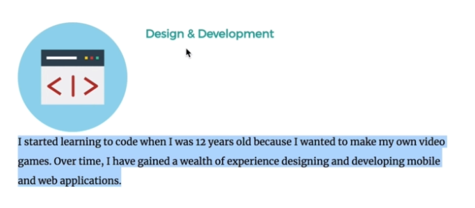

# Day 44: Web Foundation -- Intermediate CSS

## Wha We'll Make -- Stylized Personal Site

We've gotten pretty far in our journey of creating our personal website, but we are done aspiring to be like Computer Science professors.

### Challenge
- Create a new folder called `CSS - My Site`
- Create an `index.html`
- Add the HTML backbone and give your website a title of your name
- Create a css folder and a `styles.css` file
- Link up your html and css and give the background an ugly blue color


## What Are Favicons
"Favorite Icon"

An icon that would show up in your browser bar if you were on a website you favorited. Browsers try to display a favicon whether the site has one or not. 

[www.favicon.cc](www.favicon.cc)

```html
<link rel="icon" href="favicon.ico">
```

## HTML Divs
Divs allow us to structure elements differently. Divs, amongst other things, don't do anything unless you use css with it. It stands for a content-division element. It allows you to split up or divide content into separate containers or boxes so you can affect its layout separately. You can structure and style things separately from other content in your website. It'll have height if you specify it **or** if it has content. 

These have **margins**, **borders**, and **padding**. 

There are default rules for the divs contents, like `<h1>` tags. These have preset margins and can create gaps even when your div has these set to 0.

## The Box Model of Website Styling
Simple div with background color blue, 300px x 300px. If we expand it to 600px, other stuff gets pushed out of the way. We can use pixels or percentages. You can also specify a **border**. The blue area is still 300x300 with a border. The border expands its size.

**Circle shorthand**, clockwise, specifies all four sides starting at the time.

Content in the div/box; let's say it's text. We want there to be space between the text and the border. This is **padding**. 

The **margin** is a buffer zone between the current element and everything else. We can use these to affect the layout and appearance of all of our html elements (which we've learned at this point, all html elements are boxes)!

### Challenge: Make Div Boxes
- 2 Divs
- Called middle-container & bottom-container
- First div a class of top-container
- 200x200px squares
- Each with different background colors

### Challenge: Diagonal Div Boxes
```css
.top-container {
  border: solid 10px;
}

.middle-container {  
  border: solid 20px;
  margin-left: 260px;
}

.bottom-container {
  border: solid 10px;
  margin-left: 500px;
}
```

## CSS Display Property
Let's add images!

```html
<div class="top-container">
  
  <h1 class="main_header">I'm Joshua.</h1>
  <p>a data engineer.</p>
  
  
</div>
```

Looks kind of weird because the cloud is on its own line. We can handle that with **display**.

This has 4 different values:
1. Block
2. Inline
3. Inline-Block
4. None

By default, some elements are block display (h1 and p tags take up the whole width of the page; blocks out any other elements from being on the left or right). Divs, lists, and forms are also included in default block display elements.

### Span Tag
I want to underline a portion of text inside a `<p>` tag. 

```html
<!-- <div class="top-container">
  
  <h1 class="main_header">I'm Joshua.</h1> -->
  <p>a <span class="data">data</span> engineer.</p>
  <!-- 
   -->
</div>
```

```css
.data {
  text-decoration: underline;
}
```

A part of the block display has been selected separately via a `<span>`. This is an in-line display element. It only takes up as much space as it needs to in its height and width. 

### Common Inline Elements
- Spans (`<span>`)
- Images (``)
- Anchors (`<a>`)

> Why would we ever use block elements when we can use inline elements?

With inline elements, you **cannot change the width**. Block elements comply with width changes. You can also change the display of any element. That makes all of our paragraphs (instert element here) inline!

What should I do if I want an element that can occupy the same line but I also want to set the width?

Another type of display! The **inline-block** which is the best of both worlds! `` elements are *kind of* like this by default.

**None** removes the element from the website as if it didn't exist.
**visibility** can be set to *hidden*. It makes the element disappear but keeps its original position. All other elements display around as if it were, the content is simply hidden.

## CSS Static and Relative Positioning
HTML elements already have pre-defined rules of how things are displayed by default before you add any CSS. It's helpful to understand how and why it works the way that it does.

1. Content is everything
  - Height is determined by the content for block displays
  - In-line widths and heights are determined by content
2. Order comes from Code
  - Changing the order of these tags, our website displays accordingly
3. Children Sit on Parents
  - Add an h1 in a div; The header is more toward the user than the div is, effectively a `z-axis` or a `<span>` is *on top of* the `<h1>`

These three rules determine how things gets rendered on the screen.

**Position** gives you added flexibility.
1. Static
  - All HTML elements are static by default
  - Go along with the HTML rules and keep to the default HTML flow
2. Relative
  - Position the element we select relative to the position it would have been had it been static
  - If we change a position property to relative and additionally we add `left: 30px;` it will be pushed 30 pixels **from the left** of where it would have been
  - Coordinate Properties
    - Top
    - Bottom
    - Left
    - Right
  - It doesn't affect the position of anything else downscreen (its ghost remains and acts as if it maintained its original position)
  - These are basically another way of doing margins
3. Absolute
4. Fixed

### Relative Challenge
```css
.red {
  height: 100px;
  width: 100px;
  background-color: red;
  position: relative;
  left: 200px;
  display: inline-block;
}

.blue {
  height: 100px;
  width: 100px;
  background-color: blue;
  display: inline-block;
  position: relative;
  right: 100px;
}

.green {
  height: 100px;
  width: 100px;
  background-color: green;
  display: inline-block;
  position: relative;
  right: 200px;
}
```

## Absolute Positioning
```css
img {
  position: absolute
  right: 30px /*This actually shifts the elemet towards the right of the screen 30 pixels, in contrast to relative positioning pushing it towards the left edge of the screen*/
}
```
**We are positioning the element relative to its parent.** 

It also **does** affect the positioning of your HTML flow. You are taking your element out of the flow of your document. But now I can move the absolute element to anywhere on the screen relative to its parent. 

### Absolute Position Challenge
```css
body {
  margin: 0px;
}

.parent {
  height: 300px;
  width: 300px;
  position: absolute;
}

.red {
  height: 100px;
  width: 100px;
  background-color: red;
  position: absolute;
  bottom: 100px;
  right: 100px;
}

.blue {
  height: 100px;
  width: 100px;
  background-color: blue;
  position: absolute;
  top: 200px;
  left: 200px;
}

.green {
  height: 100px;
  width: 100px;
  background-color: green;
  position: absolute;
}
```

Traditionally an easier way to think about for beginners. You're moving everything relative to the position of the parent as opposed to relative to where it *used to be*. 


Containers are awesome for finetuning and visualizing. 
```css
.container {
  position: relative;
  width: 300px;
  height: 300px;
  background-color: grey;
}
```

### The Fixed Position
`position: fixed`

The element doesn't move if you scroll. 

## The Dark Art of Centering Elements with CSS

### Challenge: Cloud Positioning
Position the cloud relative to the top container.

```css
/* .top-container {
  background-color: #D5D8B5; */
  padding-top: 100px;
  position: relative;
}

.top-cloud {
  position: absolute;
  right: 300px;
  top: 50px;
}

.bottom-cloud {
  position: absolute;
  left: 300px;
  bottom: 300px;
}
```

## Font Styling in Our Personal Site
Sans-serif does **not** contains feet, or serifs.

No font is 100% websafe. You can minimize such issues, however, by using the **CSS Web Safe Fonts** recommended by w3schools.

Create a set of fallbacks for your font!
```css
body {
  font-family: "Helvetica Neue", Helvetica, Arial, sans-serif
}
```

Gives the same feel regardless of what font the user has.

What if I want them to see the design I intended? How can I ensure everyone has the same viewing experience?

**Font Embedding.** You can go to google fonts. 

```html
<link rel="preconnect" href="https://fonts.googleapis.com">
<link rel="preconnect" href="https://fonts.gstatic.com" crossorigin>
<link href="https://fonts.googleapis.com/css2?family=Merriweather:wght@300&family=Montserrat:wght@300&family=Sacramento&display=swap" rel="stylesheet"> 
```

Then just call out those fonts in `font-family` attribute values.

[Flaticon](https://www.flaticon.com) is a great place to get art.
## Adding Content to Our Website
Added lorem ipsum and other things to website.

## CSS Sizing
Increase the font-size! And **Dynamic Font Size.**

`font-size: 100%;` is equivalent to 16px. So 90px/16 = 562.5%

### `em`
The phonetic pronunciation of `M`. You want it the element to be 1-size equal to the width of a capital M. `2em` is the size of the width of two `M`s. 16px = 1em. You can achieve whatever size you want using either percentages or `em`.

### When to Use `em`, `%`, or `px`
Accessibility issues; `px` doesn't allow for auto-scaling. But not a big deal because they can just zoom in on the screen.

`em` and `%` **do** inherit and change in size based on the parent. It gets added on top of whatever its parent was.

`rem` exists to ignore parent font-sizes. This is the most adaptable, reliable, and least error-prone

Convert first paragraph tag to h2 with rem-sizing.

Add a 50px top margin to the h1. We want less space between h2 and h1.
## Font Properties Challenge 1 -- Change the Font Color
```css
h1 {
  /* width: 10%; /* This value prevents the body text-align: center from centering it; get around that with margin below */
  /* margin: 0 auto; */
  margin: 50px auto 0 auto;
  font-family: 'Sacramento', cursive;
  font-size: 5.625rem;
  color: #A25B5B;
}

h2 {
  font-family: 'Montserrat', sans-serif;
  font-size: 2.5rem;
  color: #A25B5B;
}

h3 {
  font-family: 'Montserrat', sans-serif;
  color: #809A6F;
}
```

## Font Properties Challenge 2 -- Change the Font Weight
```css
h2 {
  font-family: 'Montserrat', sans-serif;
  font-size: 2.5rem;
  color: #A25B5B;
  font-weight: normal;
}
```

## Font Properties Challenge 3 -- Change the Line Height
```css
h1 {
  /* width: 10%; /* This value prevents the body text-align: center from centering it; get around that with margin below */
  /* margin: 0 auto; */
  margin: 50px auto 0 auto;
  font-family: 'Sacramento', cursive;
  font-size: 5.625rem;
  color: #A25B5B;
  line-height: 2;
}
```

## CSS Float and Clear
Our **skills** div has 2 **skill-rows**. We want each of those skill-rows divs to only take up half of the screen. (It's a block element).

### 50% Div Challenge
```css
.skill-row {
  width: 50%;
}
```

Because the width is no longer 100%, it is no longer centered. How do we fix this?

### Center Div Challenge
```css
.skill-row {
  width: 50%;
  margin: auto;
}
```

### 100 pixel top and bottom margin while still auto centering Challenge
```css
.skill-row {
  width: 50%;
  margin: 100px auto 100px auto;
}
```

### Left Align Skill Title and Text Challenge
```css
.skill-row {
  width: 50%;
  margin: 100px auto 100px auto;
  text-align: left;
}
```

### Line Height Challenge (for paragraph tags in skills)
```css
.skill-row {
  width: 50%;
  margin: 100px auto 100px auto;
  text-align: left;
  line-height: 2;
}
```

### Change Skill Image Sizes to 25% Challenge
```css
.python-image {
  width: 25%;
}

.databricks-image {
  width: 25%;
}
```

### Wrapping Text Around an Image

Here's what it currently looks like and how we want it to change:



We can resolve this by **floating**.

```css
.python-image {
  width: 25%;
  float: left;
}

.databricks-image {
  width: 25%;
  float: left;
}
```

This should spit out something like: 



### Space Between Text and Image Challenge
```css
.python-image {
  width: 25%;
  float: left;
  margin-right: 30px;
}

.databricks-image {
  width: 25%;
  float: left;
  margin-right: 30px;
}
```

### Second Image Float Right with 30px Border Challenge
```css
.python-image {
  width: 25%;
  float: right;
  margin-left: 30px;
}
```

Another property to make sure the text does not wrap and ends up below the image is called the `clear` property.
```html
<p class="code-skill-description">I started...</p>
```

```css
.code-skill-description {
  clear: left;
}
```

This pushes the text below the image that is floating but the heading remains.



Think of it as the "anti-float". Make sure the left margin is clear and *not wrapped around anything*. 

**Float** is one of the most commonly used and abused CSS properties. Remember that it has a whole bunch of corner cases. Only use float when really *really* necessary. Only use it for what it's meant for: wrapping text around a certain element. Don't use it for positioning. Instead, use positioning, relative, absolute, padding, etc. You'll get into less trouble/problems using float as explained.

## CSS Challenge

## Stylized Personal Site Solution Walkthrough

## Get More Practice HTML and CSS
